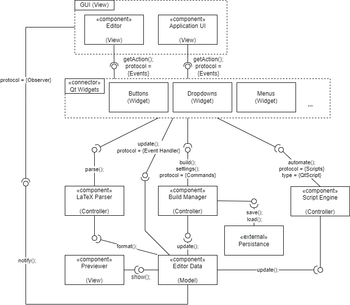
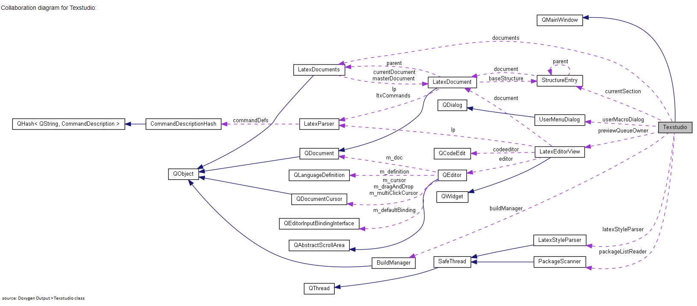

_Notation:_ We use a superscript notation to provide evidence for a statement. The evidence, along with its data collection procedure can be found in the "Verification for conformity" section of the deliverable. For example: the evidence for this statement[i] can be found in the ith entry of the "Verification for conformity" section. Some of these entries may be hyperlinks to images, websites, models, e.t.c. For interfaces we use the following notation `iAmAnAbstractInterface();`. Interfaces that are missing the "();" or that are not mentioned in the General Structure Model are not necessarily abstract and may refer to interfaces/methods in the codebase (although it will be mentioned if an interface is in the codebase). For protocols and protocol types we use this notation: _iAmACommunicationProtocol_.

## Functional View
The Functional View for TeXstudio represents how the different architectural elements identified in TeXstudio interact with each other to provide functionality to the user.

The Functional View for TeXstudio is represented using the M-V-C architectural style. The scope of this view targets developers and maintainers as their main stakeholders, however views a level of abstraction that could be understood by an average user of TeXstudio. To keep the view within scope, there is a level of detail in the feature functionality that will be abstracted (i.e: the internal pipeline or logic of specific features are not relevant to this view), and the granularity of the view is mainly determined by how impactful or how much global functionality a component provides. Some external components such as the OS, networking hardware and their interactions with the application have been deemed out of scope as [TeXstudio is meant to support all major operating systems](m2/evidence/img/support_for_os.png) (Windows, Mac, Linux) and functions locally (although it has the option to function across a network of computers).

The following model is a General Function Structure Model of TeXstudio. It serves the purpose of abstracting all the functional use cases of TeXstudio into different components, interfaces, connectors and external interfaces.

**Figure 1:** General Functional Structure Model of TeXstudio

It is important to note that these components aren't a 1:1 mapping to the codebase on the package/class level. We do not concern ourselves with the arbitrary placement of methods into files, but rather look at the responsibility each of those methods hold at the architectural level, and we produce abstract interfaces from them. An example of this is the LaTeX Parser functional component, which isn't limited to the latexparser package in the codebase. In particular, the LaTeX parser functional component includes syntaxcheck.cpp and inherits from the qcodeedit package to give the proper formatting to the Editor Data.

**Element Catalogue**
| Functional Element | Description |
| ------ | ------ |
| Editor   (View) | The Editor component in TeXstudio represents the functionality provided to frame that the user can type text into. This component maps to being a "View" in the M-V-C style as it uses the frame to display the data held in the Editor Data component, which serves as a model. The Editor is notified[\[1\]](#1) whenever a change has been made to the contents of the frame, and its responsibility is to display the output of that change (sometimes, it isn't as simple as displaying the keys that were pressed as certain event handlings come into play)[\[2\]](#2). This interaction is described by the `notify();` interface between the GUI and the Editor Data, and is triggered by the Qt `contentsChanged` signal of the Editor Data. The Editor is then updated by using the `QDocument::line` interface[\[3\]](#3). The Editor also needs to know when a key is pressed so the application is able to provide the proper event handling. This interface is provided by the "Qt widgets" connector, more particularly through `QKeyEvent`. The Editor will then have its contents updated based on the input (different inputs follow different paths)[\[4\]](#4). In the General Structure Model, this interface is referenced by the `getAction();` interface which uses the _Events_ protocol to communicate with the different Qt Widgets.
| Application UI   (View) | The Application UI component in TeXstudio represents the interactive elements that are presented to the user. These include, but aren't limited to UI shortcuts, Builder Settings, Configuration Tools, Wizards,  Macros, e.t.c. Essentially, this component is the GUI while you have no project loaded into the TeXstudio. Similarly to the Editor component, the Application UI requires the `getAction();` interface provided by the Qt Widgets to have functionality. However, the Application UI also defines its own type of _Event_, and isn't limited to `QKeyEvent`. The different elements of the Application UI[\[5\]](#5) define their own events (mostly mouse click events), and their own event handlers, and connect them using the `newManagedAction` interface TeXstudio provides to its Qt Widgets[\[6\]](#6). The Application UI is a the view for these elements and also defines the functionality for most of them. Some UI elements require access to other functional components (the Script Engine for Macros, the Build Manager for compiling, the LaTeX parser for Wizards, linting and shortcuts). It is important to note that the Application UI blurs the line when it comes to being a "View" in the M-V-C style. This is because it defines and encapsulates functionality for a lot of its elements[\[5\]](#5), however some elements (i.e: the ones that need access to other funtional components) inherit functionality from elsewhere in the codebase[\[7\]](#7), in particular from the controllers. |
| GUI   (View) | The GUI isn't a standalone functional component, it is the combination of the Editor and the Application UI. The reason this combination is needed is because certain functions affect the GUI globally[\[8\]](#8). However, since the Editor and the Application UI have different responsibilities and logic, they are distinct elements from one another.|
| Qt Widgets | The Qt Widgets do not belong to the M-V-C style of the project, in fact, they are connectors between the GUI (View) and the different controllers (LaTeX Parser, Build Manager, Script Engine). It is important to note that some of the Qt Widgets will interact directly with the Editor Data (Model)[\[9\]](#9), and this is because the Qt Widgets also have their own implementation of the M-V-C style within each widget. Some examples of these widgets are shown in the model under the form of Buttons, Dropdowns or Menus, however many more can be found throughout the project. These widgets provide an `update();` interface with _Event Handlers_ to interact directly with the model data. It does so by using the information contained in the _Event_, and then parsing that information with _Event Handlers_ to create an output that modifies the Editor Data. The other Qt Widgets will interact with the controllers using the interface they provide (`parse();`, `build();`, `settings();` and `automate();`). As mentioned in Editor and Application UI, the event handling of these widgets is defined by the `newManagedAction` interface[\[6\]](#6). This interface inherits from the behaviour of Qt and simply is a wrapper method that makes creating Widgets easier. Using the _Event_ information, each Qt Widget knows where to delegate the call.    Note: For some reason, while most widgets are instantiated using `newManagedAction`, some of widgets found within TeXstudio are instantiated only using Qt code. This creates inconsistency within the architectural definition of these widgets as there does not seem to be any clear evidence as to why not all widgets use `newManagedAction`.|
| Build Manager   (Controller) | The Build Manager is a controller that provides File Output functionality to TeXstudio. It is concerned with formatting, compiling, managing the build settings, communicating with the TeX distribution (out of scope), communicating with persistence services and producing a viewable output. The Build Manager operates under the Command design pattern[\[10\]](#10) and uses it as a protocol to communicate with other functional components. The Build Manager provides the `build();` and `settings();` interfaces to the Qt Widgets. The `build();` interface is responsible for compiling the document into a LaTeX document given the current build settings[11]. The `settings()` interface is responsible for modifying the build settings either directly or indirectly[\[12\]](#12). The Build Manager also needs to communicate with the persistence storage, in particular whilst loading and saving files[\[13\]](#13). This is represented through the `save();` and `load();` interfaces. Note that the latter two interfaces aren't limited to persistence storage provided by the system, it can also apply to version control systems such as Git and SVN[\[14\]](#14). The Build Manager also provides an `update();` interface to the Editor Data[\[15\]](#15).|
| Script Engine   (Controller) | The Script Engine is responsible for running the user-defined macros in TeXstudio. It gives functionality to the Application UI menu "Macros", and provides the `automate();` interface to the Qt Widgets by using the _Scripts_ protocol [16], which in particular uses _QtScript_ as its default script type (you can also change it to plaintext or LaTeX environment text). This `automate();` interface has the following responsibilities: allow the user to use his preferred scripting language (plaintext / LaTeX / QtScript), interpret the scripts, produce an output and modify the Editor Data based on that output [\[17\]](#17). Note that these scripts can also make use of other functional components[\[18\]](#18). |
| Persistence | Albeit for most applications persistence does not add functionality, in TeXstudio, there is support for version control systems such as Git and SVN. It requires the `load();` and `save();` interfaces that are provided by the Build Manager[\[14\]](#14). An out-of-scope interaction of the Persistence is the communication protocol with the OS. The Persistence must be able to use the OS to get access to Networking hardware and privileges (in the case of CVS versioning) or it must be able to get access to Disk storage in the case of on-system persistence. |
| LaTeX Parser   (Controller) | The component is generally used to parse the plaintext input to the editor. The latex parser component is constructed of a syntax checker and a parser, which will contribute together to parse the text input to the editor. The two most relevant parts of this component here are the `latexParser.cpp` and the `latexParsing.cpp`. The `latexParser.cpp` class implements the `latexParser` object. This parser is invoked as an object, often called `lp`, by other functions [\[19\]](#19). It is used as an interface between the latex parsing component and the different other methods which require its use. The methods will create this object and then use its different functionalities where needed. It is used specifically to parse Latex-language text. The second part, `latexParsing.cpp`, contains the `Parsing` namespace, which contains methods that are used for specifically latex token-related parsing [\[20\]](#20) (such as finding a certain token in a column for example). This component is related to the Qt widgets as the need to access different parsing methods [\[21\]](#21). Moving on to the last part of the component we consider the syntax checker (from the `syntaxcheck.cpp` file) to be part of the latex parser. Indeed, the syntax checker will heavily rely on the functions from the latexParser package[\[22\]](#22) and which it will use to parse through the text. We then see the interface with the Editor Data, which we name as `format();`. Indeed, the editor will hold the data, but also must keep in it the right format. The syntax checker from the latex parser component will do this indirectly, as it will give a red underline and an error message when trying to use incorrectly formatted latex, so the code will either not compile or it will be correctly formatted. Finally, it is important to note that this component is a controller in the M-V-C style, as the latex parser controls all of the formatting for the viewable document.[\[23\]](#23)|
| Editor Data   (Model) | The editor data component is an abstraction that we use to group all runtime elements stored in memory which have to be represented visually by the GUI. This includes the data (text) in the editor, the pdf to be displayed in the previewer, stored macros and so on. In the M-V-C style that we find throughout the application, this is the model, which holds data rather than adding more functionality. One could say that its functionality is exposing its data to other components. Its `notify();` interface is explained in the editor section. Its interface is also explained in the Latex Parser component. It will `show();` the pdf previewer its data as interface [\[15\]](#15), and it will be `updated();` by storing the newly built pdf from the Build Manager and the newly created macros from the Script Engine.|
| Previewer (View) | The previewer is a component used to display the preview to the user. It has a `show();` interface with the Editor Data, by which the preview data built by the build manager is exposed to the previewer so that it can be displayed. The previewer is a view in the M-V-C style which is displayed to the user and is updated as the preview build is updated and new data is stored. |

The level of abstraction that was reached in the General Functional Structure Model allows for the stakeholders to target specific Functional Scenarios or interactions between functional components, and model them by decreasing the amount of components, and if willing, increasing the detail in the interfaces. In other words, in the General Functional Structure Model, the components are abstract enough to give a global overview of the Functional View, however, it is possible to decrease the level of abstraction in the interfaces to target certain specific use cases of the project's functionality. The Functional Components also display very clear and definite boundaries (LaTeX parsing does not overlap with build management, scripting does not use the same run-time engine as LaTeX parsing, the Editor view is distinct from the Application UI, and their views are independently updated, Qt Widgets can be abstracted out of the model into the respective interfaces it provides e.t.c).

In fact, an example of this tactic being put in use can be found [here](m4/functional_scenario.md). The latter documents how developers and architectural documenters (not mutually exclusive) can use eachother's works to produce relevant sequence diagrams that is close to the code so that the developers can work on a feature, but also abstract enough so that it is generalized architecturally. 

## Verification for Conformity
_Note: Due to the size of certain caller/callee graphs and the limitations of our screen sizes, no image can be produced to show the entirety of them, however they can be found in the Doxygen Output._

If you are viewing the evidence through the hyperlinks, here is the legend that describes the relations between the codebase elements:

The following is the collaboration diagram produced by Doxygen for the whole of TexStudio. It gives a good global picture of different relationship (as per above legend) in the code structure, and shall be referenced later on in the evidence.

1. A change here is defined by an event that will alter the contents of the editor itself. These include, but aren't limited to, pressing keys, using macros, pasting from the clipboard, importing bibliographies, e.t.c. [The Doxygen call graph for such an event](m2/evidence/img/qeditor_write.png) shows that the application is concerned with handling the event first through its Controller components, and then once it has produced an output, it will notify the editor to display that output (QEditor::write).
2. Certain operations, such as [a "paste" operation](m2/evidence/img/qeditor_paste.png), require event handling before altering the contents of the editor. In these scenarios, the Editor does not reflect the event itself (i.e: a paste operation can by triggered by CTRL + V, but you wouldn't want the editor to display CTRL + V), but rather [the output of the event](m2/evidence/img/qeditor_paste2.png).
3. This can be seen in the Doxygen output, with the caller graphs of `QDocumentCursor::hasSelection`, `QDocument::lineRect`, `QEditor::repaintCursor` and `QDocumentCursorHandle::line`. These are all callers of `QDocument::line`, and use the _Event_ protocol to get/set the information at the line concerned by the _Event_. No image can be produced to show these graphs due to their size.
4. The Doxygen output `QEditor::keyPressEvent` displays the callee graph of keyPressEvent. Within this graph, you can observe that this method is concerned with updating the contents of the Editor based on the `EditOperation` provided by the `QKeyEvent`. Analyzing through the code, you may observe the method keyPressEvent will then choose the path that corresponds to the given `EditOperation` through a [C++ switch case](https://en.cppreference.com/w/cpp/language/switch), and if the `EditOperation` corresponds to no valid operation, then it will follow the default path. No image can be produced to show the keyPressEvent callee graph due to its size. 
5. Examples of these Application UI elements are: New File, New From Template, Open, Open Recent, Save As, Save All, Make Template, e.t.c (texstudio.cpp lines 838-1388). The `newManagedAction` [interface](m2/evidence/img/texstudio_newmanagedaction.png) requires a Qt Widget (Application UI), a view (usually a title and an icon) and method (Event Handler). There is also an [overloaded version](m2/evidence/img/texstudio_newmanagedaction_overloaded.png) of this interface which allows you to add support for Keyboard shortcuts (`QKeySequence`).
6. The `newManagedAction` interface was deemed out of scope for the general structure model as it is only a "shortcut" between TeXstudio and standard Qt functionality. It does not add any new or required functionality, it only makes the Qt Widget creation process easier.
7. The functionality for compiling a document is found in the Build Manager component, which holds its own functional logic, while the UI element for compiling is found in the Application UI element.
8. Some of these functions are closing/minimizing the window, loading the application, loading a new file, changing the color style of the application, e.t.c.
9. An example of a Qt Widget that does this is the "New" button in the "File menu". This Qt Widget is associated to [Texstudio::fileNew](m2/evidence/img/texstudio_filenew.png), which only relies on [Texstudio::fileNewInternal](m2/evidence/img/texstudio_filenewinternal.png). This method does not use any functionality from the controllers, and interacts directly with the Editor Data (in fact, it instantiates it).
10. All operations in the Build Manager component are defined as [commands](m2/evidence/img/buildmanager_cmddefine.png) and [are sometimes used by Qt widgets](m2/evidence/img/buildmanager_preview.png). Note that not all commands are linked to their own respective Qt widgets. However, the Application UI has the responsibility to assign commands to UI elements in relation to building tasks.
11. Code snippet from `texstudio.cpp` line 1110: `newManagedAction(menu, "quickbuild", tr("&Build && View"), SLOT(commandFromAction()), (QList<QKeySequence>() << Qt::Key_F5 << Qt::Key_F1), "build")->setData(BuildManager::CMD_QUICK);`
In particular, this code snippet assigns the "build" functionality to the "Build & View" UI element, however this functionality is accessed using the Build Manager command protocol.
12. In TeXstudio you have the option to choose your own build settings. This includes things such as [choosing the default compiler, viewer, bibliography tools, user defined commands, e.t.c](m2/evidence/img/buildmanager_config.png). However, certain events will cause the build settings to update independently from the user. An example of this is [while loading a file](m2/evidence/img/texstudio_load.png), the Application must notify the compiler not to recompile the bibliographies (unless they get modified). In this case, the `settings();` interface receives an update from the Application UI, despite the initial _Event_ not being one that affects the build settings.
13. As mentioned in index 12, loading a file updates the current build `settings();`. However, you also have the [save interface](m2/evidence/img/texstudio_filesaveas.png) that creates and runs Build Manager command to complete the saving task.
14. [This excerpt of buildmanager.cpp](m2/evidence/img/buildmanager_cmddefine.png) displays that the Build Manager must support commands for Git and SVN versioning, between lines 68 and 70.
15. An example of this is while compiling for preview, [the Editor Data must hold the preview data](m2/evidence/img/texstudio_showpreview.png) so it can load the previewer with it. Also, the caller graph for `Texstudio::showPreview` interacts with the Editor Data to diplsay the preview, but an image cannot be produced because of its size. 
16. In the [class collaboration diagram for the Script Engine](m2/evidence/img/scriptengine_collab.png), we can see that `texstudio.cpp` inherits from the Script Engine. In particular, `texstudio.cpp` is responsible for creating all the Qt Widgets in the application, and therefore is a major part of the Application UI, hence why the `automate();` interface is provided to the Qt Widgets; it serves as a connecting interface between the UI and the Script Engine.
17. The `automate();` interface allows you to use Qt Widgets to [write a script](m2/evidence/img/scriptengine_setscript.png) and [run those scripts](m2/evidence/img/texstudio_runscript.png) to edit the Editor Data.
18. You can write a script that automatically saves/loads files or compiles into a specific TeX compiler (making use of the Build Manager), or you can use a script that automates Wizard uses (making use of the LaTeX parser).
19. Such as the `LatexDocument` and the `LatexEditorView`. This can be seen in the figure presented just above the so-presented evidence, the collaboration diagram generated by Doxygen for the whole of TexStudios.
20. This is shown in this comment at the top of the file: “This is the new Token-based parser.”
21. For example, `Texstudio::previewLatex` uses the `Parsing::getTokenAtCol` method.
22. The main docstring at the top of the `syntaxcheck.cpp` file says: “class SyntaxCheck”: “asynchrnous thread which checks latex syntax of the text lines”. Many of its methods use a LatexParser object.
23. The latex parser controls the format of the text displayed in the document. An example of this is in the `SyntaxCheck::run` [method](m2/evidence/img/syntaxcheck_run.png), which formats the text using CSS.
