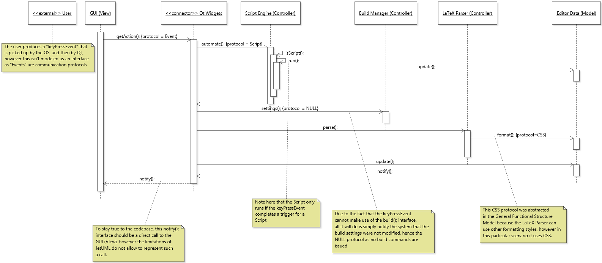
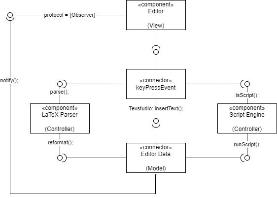
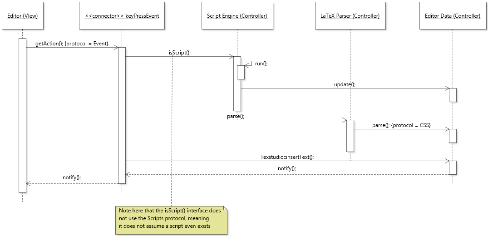

The level of abstraction reached in the General Functional Structure Model allows the stakeholders to model targetted Functional scenarios, with a decreased number of components and a decreased level of abstraction in the interfaces provided. In essence, this means that it is possible to model scenarios such that only the relevant interactions between Architectural Components appear, and their interfaces can approach a level of abstraction that stays true to the codebase, sometimes even directly referencing the code.

## Functional Scenario: keyPressEvent

If we are simply concerned about a functional use case of the Editor's reaction to a `keyPressEvent` that immediately updates the content of the Editor view, then we do not need to model the Application UI, the Build Manager, the Persistence or the Previewer. In fact, since we are only concerned with the `keyPressEvent` in this case, we can even abstract the Qt Widget connector into a `keyPressEvent` connector. This is because the only functionality the Qt Widget provides to the Editor is finding processing the type of _Event_ (is it a key press/mouse click/short cut?) and delegating the call to the appropriate handler. In this case, since we already know the _Event_ is a `keyPressEvent`, then there are only 3 possible chain of events:

1. The pressed key does not complete a trigger for a script and also does not require a reformat of the Editor Data from the LaTeX Parser.
2. The pressed key does not complete a trigger for a script but does require a reformat of the Editor Data from the LaTeX Parser.
3. The pressed key does complete a trigger for a script.

Therefore, we would only need to model the Editor (View), the keyPressEvent, the LaTeX Parser (Controller), the Script Engine (Controller) and the Editor Data (Model). The interfaces between these components can be even more precise than it was in the General Structure Model because certain responsibilities are out of scope for this scenario, for example, the `keyPressEvent` can only add a character to the Editor Data (if it meets case 1 or 2), thus only needs the `Texstudio::insertText` interface (note that this is taken directly from the codebase). Another example would be that the Script Engine now does not need to create scripts, it just needs to check if the added character completes a script, and if so, it should run that script (case 3). Remark that in all 3 cases, the `keyPressEvent` will communicate directly with the Editor Data to add the edited character, it's just that in case 2, the data has to be reformatted, and in case 3, a script has to be ran.

Taking this into account, a keyPressEvent only makes use of the Editor (View), the keyPressEvent (Connector), the LaTeX Parser (Controller), the Script Engine (Controller) and the Editor Data (Model). This allows the presenter to avoid describing null interactions between components and allows for the relevant interactions to be less abstract. In fact, a sequence diagram that wants to take everything into account would look as follows:

**Figure 1.** Flawed Sequence Diagram of a keyPressEvent scenario

In such a diagram, you can observe that there are abstractions and interactions that are not necessarily required, in particular, the abstraction of GUI (View), the interactions including the Build Manager, and for the sake of simplicity the Persistence was already removed from the diagram. Taking into account what was mentioned earlier about the relevant functional components for such a scenario, we can model the program and its interactions as such.

In fact, in the case of a keyPressEvent scenario, using the control flow between Functional Elements allows us to get the following Functional Model of this scenario:

**Figure 2.** A Functional Model of the Relevant Components for a keyPressEvent scenario

This model does not include functional elements which are never apart of the control flow of the system in this scenario. In a similar vein, the interfaces that are shown above are the only relevant interfaces for the concerned functional elements, which allows the model to be even closer to the code (note that Texstudio::insertText refers **directly** to a method in the codebase). Using these components and interfaces, we can model the scenario as follows:

**Figure 3.** Improved Sequence Diagram of a keyPressEvent scenario

In general, this tactic allows Architectural Documenters of TeXstudio to increase or decrease abstraction to produce documentation that is closer to the code and provides more relevant information. In the same fashion, developers, especially new-comers in the project, can make use of that documentation to precisely pin-point where the code is located and what it affects.
