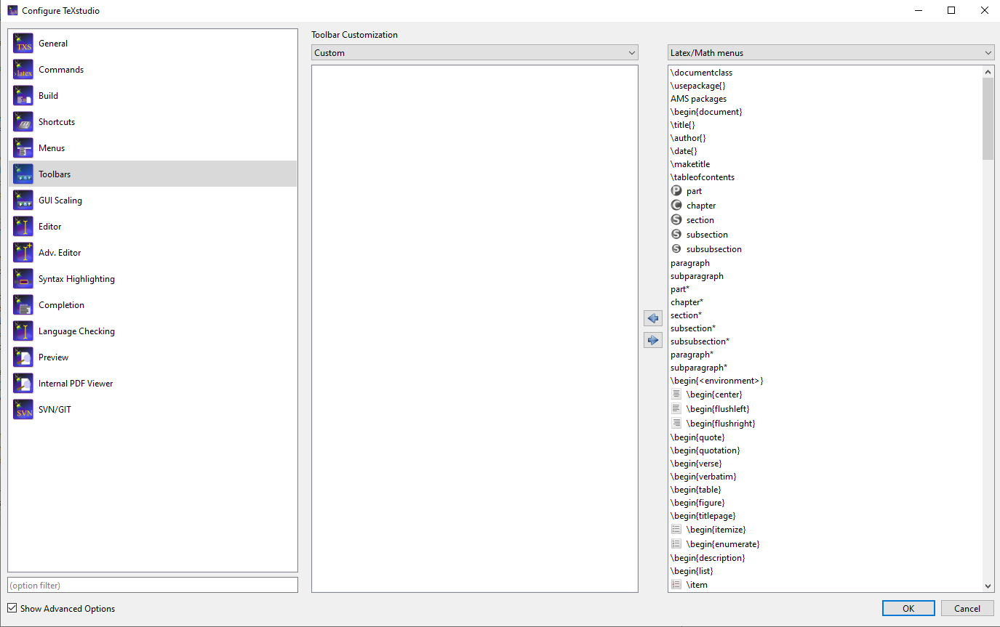
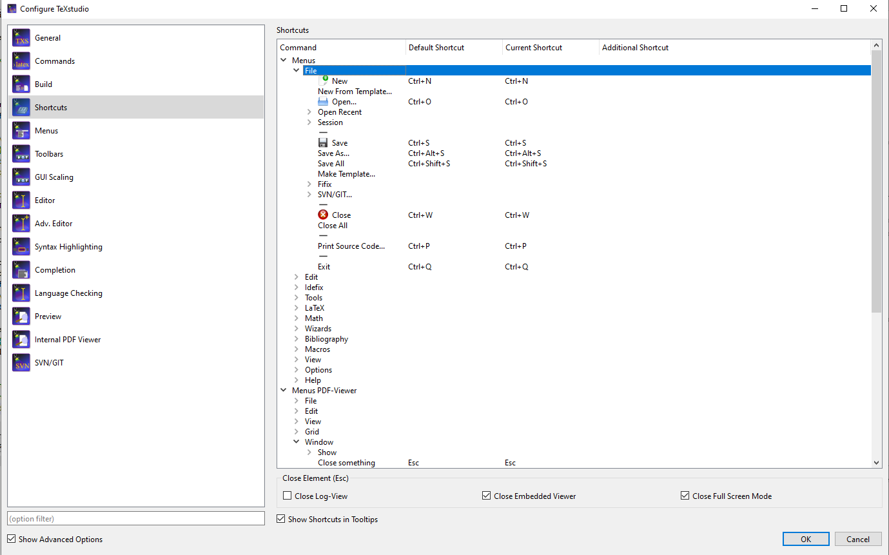
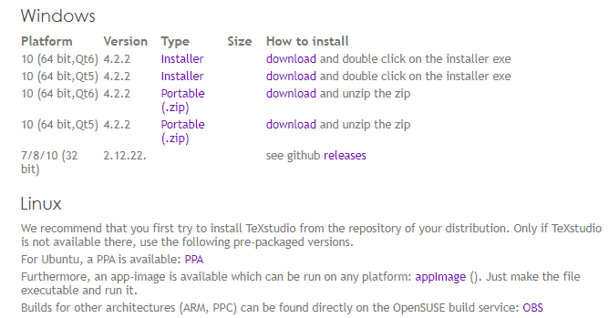
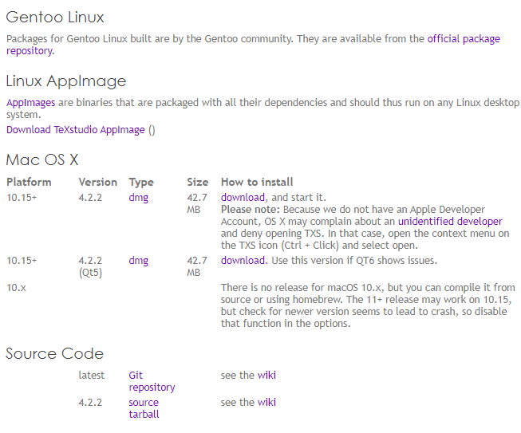
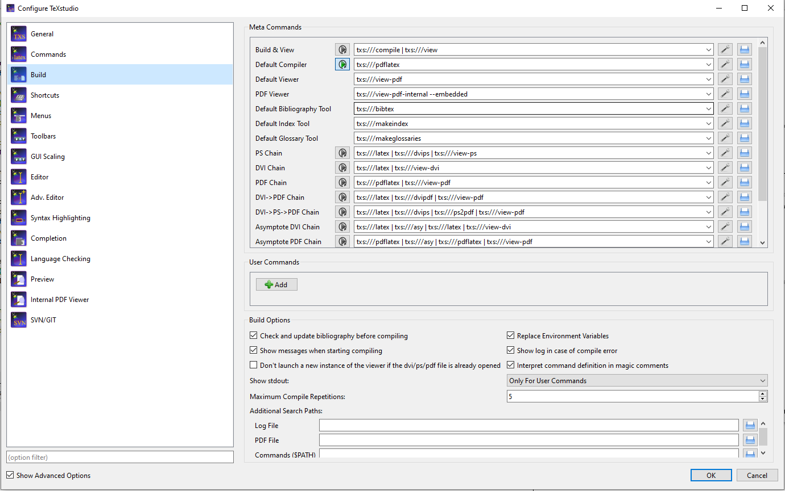

# Usability Perspective

TeXstudio being a heavily user-interface dependent software, it makes most sense to apply the usability perspective to the different views (when applicable). In fact, the usability perspective is most relevant to the functional view, information view and deployment view. For each of the views, we establish a list of **concerns** and **tactics** that need to be taken in consideration for optimizing the usability of TeXstudio.

The main concerns that will be covered are **simplicity**, **consistency** and **efficiency** of the system with regards to each relevant view. Note that the usability cannot be applied to the Context View.

## Simplicity

- Functional View: The main concern here is that the UI should be simple and easy to use/navigate. The usability of the software is heavily dependent on how simple the functional view is. In fact, by applying an appopriate amount of separation of concerns, TeXstudio is able to provide a large set of features through its UI. Each of these UI elements map directly to one of the functional elements. The tactic that was used to make this possible is by using the Qt Framework to create different toolbars that could then be used, navigated and even customized. This gives the user complete freedom over the set of features they want to use, as well as where they want to access them. It is even possible to assign shortcuts to most of these features, thus making it even easier to access them. 

**Figure 1.** Snippet of the default toolbar

**Figure 2.** Toolbar customization interface

**Figure 3.** Shortcuts customization interface

- Information View: Although only slightly applicable, it is worth mentioning that the user's participation in the information flow of TeXstudio is nearly inexistent, at least for common uses. This is an obvious, yet important concern because, without loading and saving files, TeXstudio would not be able to provide any type of relevant functionality to users. Loading a tex file into TeXstudio is extremely simple through the user-interface and requires no configuration. Likewise, compiling and saving the output of a tex file is done by the press of a button. 

- Deployment View: The main concern here is that the software must be easy to install and be easily extensible. Apart from the LaTeX distribution required to compile, TeXstudio is deployed as a standalone software, successfully addressing that concern. Although some of its more advanced features (LanguageTools, Syntax Checking, CVS through Git/SVN, e.t.c) will require access to external software that needs to be deployed on some machine; for the general use case, TeXstudio is easily installed through the wizard and is ready to run and compile tex files upon installing the LaTeX distribution of your choice.

**Figure 4.** Installation instructions on texstudio.org

## Consistency

- Functional View: TeXstudio is concerned with providing the same set of features on every single machine that runs the same version. This means that not only should TeXstudio be architecture-agnostic, but also shouldn't have features that are dependent on anything other than the installation you are currently running. TeXstudio achieves this by establishing a very clear and bounded set of features which can be _customized_ and _configured_, but not added or removed.

- Information View: When a file is loaded, it should be loaded exactly the same way on all machines and produce the same exact output every time. In other words, the decoding and encoding of tex files should be standard to TeXstudio and should not alter from installation to installation. When it comes to the decoding of the tex file, it is very simple as tex files are saved in plaintext. Thus, TeXstudio only has to open the file, show its content in the editor and run the LaTeX parser to provide linting or warning/error messages. The encoding of a file is entirely dependent on the compiler the user wants to use, as well as the LaTeX distribution, thus its output is out of scope for TeXstudio, but it still has the responsibility of letting the user choose the method they want to compile with.

**Figure 5.** Build settings customization interface

- Deployment View: TeXstudio must be able to be deployed on Windows/MacOS/Linux. In fact, the [user manual](https://htmlpreview.github.io/?https://github.com/texstudio-org/texstudio/master/utilities/manual/usermanual_en.html#SECTION0) mentions no functional differences between deployments of TeXstudio on the distinct operating systems it supports. There are small differences in terms of command line and file system semantics, those, however, are out of scope for TeXstudio as they are simply due to the different shells and registries that are available on Windows / MacOS / Linux. 

## Efficiency

Note that efficiency here does not only relate to how _fast_ does TeXstudio run tasks, but also how fast can the user of TeXstudio complete tasks.

- Functional View: The main concern here is that the UI must be efficient in terms of providing functionality to the user. We define an "efficient UI" as one that can be tweaked to the fit the user's needs as per the user's request. TeXstudio achieves this in two ways: (1) it allows the user to customize the UI, configure how it functions/looks and establish shortcuts; and (2) TeXstudio is open to [bug reports](https://github.com/texstudio-org/texstudio/labels/bug) and [enhancements](https://github.com/texstudio-org/texstudio/labels/enhancement). The first one allows the user to decide how they want to use the software and can make the most out of it to boost their efficiency. The second one allows the user to provide feedback to the developer to get more features or to fix/change existing features. In general, this is due to the simplicity of implementing a UI element. Once the feature for a UI element is fully coded, it is as simple as dedicating a position in the GUI to host that UI element, and the user is free to utilize it. The tactic that is used to make this possible is by separating the UI element's functionality from its display. This allows the user to move the display, and the developers to modify the functionality, both without affecting the other.

- Information View: The main concern is that compile times and information flow of the software must be quick and efficient. This is out of scope for TeXstudio as compiling the tex file is done by the LaTeX distribution, thus TeXstudio is only concerned with providing information to the compiler in a quick fashion that can be easily modified through future updates.
